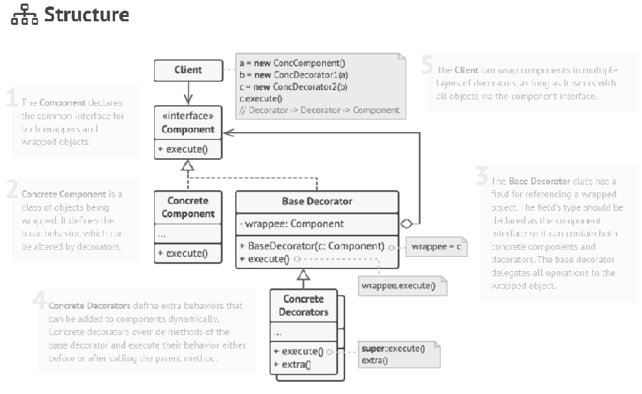

## Decorator (wrapper)
將物件包在另一個物件，並且修飾該物件原有的功能。

## 問題
現有的物件能夠實現某種功能，而有個需求需要類似的功能，但是與該功能有點不一樣，如果為了實現目標功能而再去實作一個物件出來，這樣若日後有相似的問題，則會產生很多的subclass。

## 解決
implement該功能類別，並has a 該功能的實作物件。而decorator在被呼叫方法後，就會去實際呼叫他擁有的物件，當該物件回傳結果後，再修飾其結果，最後才回傳到client端。Decorator可以有好幾層，呼叫的方式會很像遞迴，由最裡面把結果回傳到最外面的Dcorator。

結構

## 實例:
InputStream 

https://www.youtube.com/watch?v=GCraGHx6gso